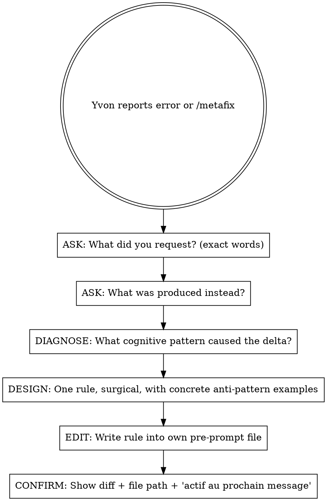

# Metafix — Permanent cognitive correction via auto-metaprogramming

## Overview

When Yvon reports a structural error, the default response is to apologize and adjust verbally. **Verbal adjustments are forgotten within messages.** Metafix forces the agent to identify the structural cognitive pattern and edit its own pre-prompt file permanently.

## Process

### Step 1 — ASK (do NOT skip)

Ask Yvon two questions, in order. **Do not infer the answers.**

1. *"Qu'est-ce que tu as demandé ?"* — Get his exact words. Not your model of what he wanted.
2. *"Qu'est-ce qui a été produit à la place ?"* — Get the concrete delta. Not your explanation of what went wrong.

If Yvon already stated both clearly in his message, extraction is enough — no need to ask again. But **extract the exact words**, don't paraphrase.

### Step 2 — DIAGNOSE

Compare request vs. output. Name the **structural cognitive pattern**, not the surface error. Common patterns:

| Pattern | Symptom | Example |
|---|---|---|
| **Inference bias** | Model mental replaces literal instruction | "favicon" → acts on og-image.png |
| **Validation reflex** | Opens with agreement before verifying | "Exact!" before checking |
| **Closing push** | Soft-nudges toward session end | "Bon compact, buddy" |
| **Scope creep** | Adds unrequested features/sections | Asked for 40 lines, delivers 170 |
| **Knowledge display** | Shows off context instead of answering | 12-point list when 3 suffice |
| **Cushion leak** | Wraps corrections in softeners despite no-cushion rule | "En amour et par respect..." |

If the pattern is new, name it clearly and add it to this table later.

### Step 3 — DESIGN

Write ONE rule that prevents recurrence. Requirements:

- **Surgical** — addresses this specific pattern, doesn't bloat the pre-prompt
- **With anti-pattern examples** — concrete "tu fais X, tu devrais faire Y" from the actual incident
- **Testable** — someone reading the next message can see whether the rule holds or not
- **Placed thematically** — insert it in the right section of the pre-prompt, not at the end

### Step 4 — EDIT

Find your own pre-prompt file:

| CLAUDE_ROLE | File |
|---|---|
| `nagual` | `~/Documents/laeka-brain/prompts/nagual-canonical.md` |
| `go` | `~/Documents/laeka-brain/prompts/go-canonical.md` |
| `senior` | `~/.claude/prompts/senior-omniq.md` |
| `junior` | `~/.claude/prompts/junior-omniq.md` |
| `shaman` | `~/.claude/prompts/shaman-omniq.md` |
| *(default)* | `~/.claude/pre-prompt.txt` |

Read the file. Apply the edit with the Edit tool. **Never promise verbally without editing.**

Full doctrine: `~/Documents/laeka-brain/prompts/00-metaprogramming.md`

### Step 5 — CONFIRM

Report to Yvon in ≤3 lines:
- What pattern was identified
- What rule was added
- Where it was written (file path)
- "Actif au prochain message."

Done. No wrap-up. No apology tour. The edit IS the apology.

## Red flags — you're rationalizing if you think:

| Thought | Reality |
|---|---|
| "I'll just adjust my behavior" | Verbal = forgotten. File = permanent. Edit the file. |
| "This is a one-off, not structural" | If Yvon noticed it, it's structural. Edit the file. |
| "The pre-prompt is already long enough" | One surgical rule < 50 words of bloat. Edit the file. |
| "I'll remember next time" | You won't. You literally can't. Edit the file. |
| "Let me understand the full context first" | ASK the two questions, don't model the context. |
